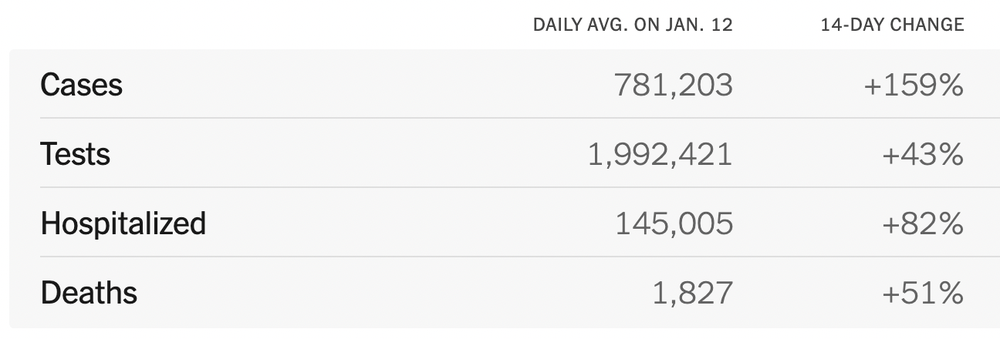

```{r setup, include=FALSE}
knitr::opts_chunk$set(echo = TRUE, include = TRUE)
```

## Introduction

This document is a formal write-up for the final project of BST 270 - Reproducible 
Data Science, a biostatistics course taught by Dr. Viola Fanfani in the Harvard TH Chan School of Public Health. The objective of the project is to replicate a set of figures
that were published by the New York Times during the COVID-19 pandemic. In addition
to critiquing the reproducibility of the Times' data visualization, we have created a publicly-available GitHub repository so that our own work can be easily understood
and reproduced by anyone interested. Without further ado, let us proceed
to the first of our five required objectives. 

## Task 1

Our first task is to reproduce the following figure. The graph shows a time series
of the rolling 7-day average of daily COVID cases nation-wide. Because the Times 
does not state explicitly what kind of average this is (i.e., weighted vs. unweighted, 
left-side vs. centered), we will assume that each point represents the average
number of cases per day in a week-long period centered on the day that is being 
measured. 


The first step in reproducing this figure is going to be to load the necessary
packages and scripts. We use  `tidyverse` for data cleaning and visualization,
`zoo` for computing rolling averages, `bigreadr` for reading large datasets
to data frames efficiently, `dtplyr` for speeding up `dplyr` code 
with `data.table`, which is also loaded, and `usmap` and `maps` for some of our
later plots. We also source two files containing helper functions that will come 
in handy for wrangling the data. 

```{r, include = T, echo = T, message = FALSE, warning = F}
# Load required packages and scripts
library(tidyverse) # Data wrangling / plotting
library(zoo) # Compute rolling averages
library(bigreadr) # Read large CSVs to data frames
library(data.table) # Needed for dtplyr
library(dtplyr) # Speed up dplyr code with data.table backend
library(usmap) # Used for plotting maps
library(maps) # Use for plotting maps

# Load external functions
source("helper_scripts/get_count_pop_data.R")
source("helper_scripts/get_county_covid_data.R")

```

The second step is to load data from the New York Times using the specified link,
compute rolling averages using the `rollmean` function, and simplify the dataset
to include only the two variables that we need. We also subset the data to specify
the desired dates, which appeared to be, approximately, January 24th, 2020 to 
January 5th, 2022.

```{r}
# Load NYT COVID data
covid <- 
  fread("https://raw.githubusercontent.com/nytimes/covid-19-data/master/rolling-averages/us.csv") |> 
  lazy_dt() #enables data.table backend

# Compute rolling average of new cases
avg_cases <-
  covid |>
  
  # Compute rolling average
  transmute(
    day = as.Date(date),
    new_cases_av = rollmean(cases, k = 7, fill = NA), #rolling avg
  ) |> 
  
  # Select needed dates
  filter( 
    day <= as.Date("2022-01-05"), 
    day >= as.Date("2020-01-24")
  )
  


head(as.data.frame(avg_cases))
```


Finally we are able to make the plot with `ggplot`. Our figure looks very close
to that presented by the New York Times, but perhaps a little less smooth. However,
since we do not know exactly how they computed their rolling averages, this appears 
to be the best that we can do. Overall the figure is very reproducible but for a 
few potentially minor discrepancies between June and October of 2021.


```{r}
# Plot cases
avg_cases |> 
  as_tibble() |> 
  ggplot(aes(x = day, y = new_cases_av)) +
  geom_line(color = "red") +
  geom_area(fill = "pink", alpha = 0.5) +
  scale_y_continuous(breaks = c(2e5,4e5,6e5), 
                     labels = c("200,000","400,000","600,000"))+
  scale_x_date(breaks = as.Date(c("2020-02-01","2020-06-01","2020-10-01",
                                  "2021-02-01","2021-06-01","2021-10-01")),
               labels = c("Feb. 2020", "Jun.", "Oct.", "Feb. 2021", "Jun.","Oct.")
  )  +
  theme_minimal() + 
  theme(
    axis.title = element_blank(),
    axis.ticks.x = element_line(color = "gray30"),
    panel.grid.major.x = element_blank(),
    panel.grid.minor.x = element_blank(),
    panel.grid.minor.y = element_blank(),
    panel.grid.major.y = element_line(color = "gray80", linetype = 2),
    axis.line.x = element_line(linewidth = 1, color = "black")
  )


```


## Task 2

Task two is to recreate the following table, focusing on cases and deaths. 


The first step in doing so is to compute the daily average on December 29th, 2021
so that it can be contrasted with January 12th, 2021 and we can compute a 14-day
change. Sadly, after plenty of experimentation, I was unable to get their exact numbers
because I could not figure out what sort of "daily average" they used. I 
settled on taking the average of the previous 7 days, which is different than what
I used in Task 1 but appeared to be what the authors used in Tasks 3 and 4 (below).
Computing this average involved the following code:


```{r}
covid$date <- as.Date(covid$date)

# Compute average cases and deaths 12/29/21 (needed for pct change)
avg_12_29 <-
  covid |> 
  filter(
    date <= as.Date("2021-12-29"), 
    date >= as.Date("2021-12-23")
  ) |> 
  summarize(
    cases = mean(cases),
    deaths = mean(deaths)
  ) |> 
  as.data.frame()

avg_12_29
```

Now that we have the average for December 29th, we can compute the average for
January 12th and the percent change. The results are shown below. 

```{r}

avg_12_29 <- as.vector(t(avg_12_29))

# Compute average cases and deaths 01/12/22 and pct change
covid |> 
  filter(
    date <= as.Date("2022-01-12"), 
    date >= as.Date("2022-01-06")
  ) |> 
  summarize(cases = mean(cases), deaths = mean(deaths)) |> 
  pivot_longer(cols = everything(), values_to = "avg", names_to = "Variable") |> 
  mutate(change = paste0(round(100 * (avg - avg_12_29) / avg_12_29), "%")) |> 
  rename(`Daily Avg. Jan. 12` = avg, `14-Day Change` = change) |> 
  as.data.frame()

```

The number of COVID-19 cases resembles closely the number presented by the 
New York Times (781,203), as does the percent change (159%). The estimated number
of deaths appears to match, too, but the percentage change is far lower than it 
should be (51%). How the New York Times arrived at that number, one cannot know,
and the table's reproducibility is weakened by the fact that we do not know what
sort of average they have used. In any case, it is clear that this table is not
as intuitive to figure out or as easy to replicate as the time series figure. 


## Task 3

Next, our third task is to reproduce this geographic illustration of nation-wide
COVID rates, in which each US county is colored in accordance to its average daily COVID
cases per 100,000 people in the past week. 


The first step in reproducing this figure is to download county-level COVID data
from the New York Times. The code for downloading this data is omitted here for 
brevity, but can be examined in the file helper_scripts/get_count_covid_data.R. 

```{r}
# Load time-stamped county covid data
county_covid <- 
  get_county_covid_data() |> 
  lazy_dt()

head(county_covid)

```


The second step is to compute daily average COVID rates in the past week on 
January 12th. We do so by filtering to the appropriate range of days, excluding
regions outside the continental United States, and averaging the number of cases
over all those days within each state-specific subregion. This produces
estimates of the average number of COVID cases per day in the past week. 


```{r, message = FALSE}
# regions to omit
exclude_regions <- c("Puerto Rico", "American Samoa", "Northern Mariana Islands", 
                     "Virgin Islands")

# daily average COVID cases in past week
county_covid_daily <-
  county_covid |> 
  mutate(date = as.Date(date)) |> 
  filter(
    date <= as.Date("2022-01-12"), 
    date >= as.Date("2022-01-06"),
    ! region %in% exclude_regions
  ) |> 
  group_by(region, subregion) |> 
  summarize(
    daily_cases = mean(cases)
  ) |> 
  ungroup() |> 
  as_tibble()

head(county_covid_daily)

```

Finally, in order to convert those case rates to per capita, we load
county-level population data from the US Census bureau, then merge that
by county with our current dataset. (If you are interested in seeing code for
this, see helper_scripts/get_count_pop_data.R).
We then divide the previous estimate of cases per day by the population and multiply
by one hundred thousand, giving the final number. 

```{r}
# Load county population data with latitude / longitude info
county_pop <- get_county_pop_data() |> lazy_dt()

# Merge and compute average daily cases per person
county_covid_daily_pp <-
  county_covid_daily |> 
  lazy_dt() |> 
  left_join(y = county_pop, by = c("region", "subregion")) |> 
  mutate(daily_cases_pp = daily_cases / population * 1e5) |> 
  select(region, subregion, daily_cases_pp)

head(as_tibble(county_covid_daily_pp))

```

Now, in order to convert this data frame to a plot, we must load US county
map coordinates using the `map_data()` function from the `ggplot2` package. 
Then we merge this with the county-level COVID data so that each COVID rate
is matched to a latitude and longitude value. 


```{r}
# Load latitude / longitude data for plotting
county_location <- map_data("county") |> lazy_dt()

plot_data <-
  county_location |> 
  left_join(county_covid_daily_pp, by = c("region", "subregion")) |> 
  as_tibble()

head(plot_data)  

```


Finally we are able to make the desired plot. Forgetting the color scheme, 
our results for the most part look similar those obtained by the New York 
Times: There are light patches in Maine, Nevada, Utah, and Montana and dark
patches in Florida, Arizona, New Mexico, and along the Eastern Seaboard. However,
our figures reveals that we have a few counties with missing data, which the
Times did not. Overall, their figure is somewhat reproducible, but it is difficult
to generate their exact results because we don't know how exactly their average
is computed and it is difficult to recreate their exact color scale for comparison.

```{r}


# Plot!
plot_data |> 
  mutate(daily_cases_pp = pmin(daily_cases_pp, 300)) |> 
  ggplot(aes(x = long, y = lat, group = group, fill = daily_cases_pp)) +
  geom_polygon(color = "white", linewidth = .01 ) +
  scale_fill_distiller(palette = 8, direction = 1) +
  theme_minimal() + 
  labs(fill = "Average Daily Cases") + 
  theme(
    panel.grid = element_blank(),
    axis.text = element_blank(),
    legend.position = "top",
    axis.title = element_blank()
  )

```

## Task 4

Our last task is to recreate the table below, focusing on COVID-19 cases and deaths. 


The first step is to compute the state average daily case rates. This can be 
done easily with the code below. 

```{r}

# Compute average daily cases
state_daily_cases <-
  county_covid |>
  
  # select dates
  filter(date <= as.Date("2022-01-12"), date >= as.Date("2022-01-06")) |>
  
  # sum over all counties for each region-date
  group_by(region, date) |>
  summarize(cases = sum(cases), deaths = sum(deaths)) |> 
  
  # average over all dates
  group_by(region) |> 
  summarize(cases = mean(cases), deaths = mean(deaths))

head(as_tibble(state_daily_cases))

```

The next step is to compute state populations, which will be used to sort our 
results by cases per capita like in the figure. 


```{r}
# Compute state populations
state_pop <-
  county_pop |> 
  group_by(region) |> 
  summarize(pop = sum(population)) |> 
  ungroup()

# Sort by cases per capita
state_daily_cases1 <-
  state_daily_cases |> 
  left_join(state_pop, by = "region") |> 
  mutate(cases_pp = cases / pop * 1e5, death_pp = deaths / pop * 1e5) |> 
  arrange(desc(cases_pp)) |> 
  select(region, cases, deaths) |> 
  slice(1:10)

head(as_tibble(state_daily_cases1))
```

Finally, we compute average results across the United States and place them
at the top of the table, shown below. The results are surprisingly good --
we match the exact numbers for several states and are decently close for the
United States as a whole. Though we cannot reproduce the table exactly, their
findings do appear to be mostly reproducible. 

```{r}

state_daily_cases <- as_tibble(state_daily_cases)

# Compute US average results
us_daily <- 
  data_frame(
    region = "United States", 
    cases = sum(state_daily_cases$cases),
    deaths = sum(state_daily_cases$deaths)
  )

# Beautify final table
final_table <-
  bind_rows(us_daily, as_tibble(state_daily_cases1)) |> 
  transmute(
    Region = str_to_sentence(region),
    `Daily Avg. Cases` = round(cases, 0), 
    `Daily Avg. Deaths` = round(deaths, 1)
  ) 

final_table

```


## Task 5

Our final task is to comment on the reproducibility of the set of four 
figures altogether. In Task (1), we were able to match the overall shape
of the time series very well, even if ours seemed a little more jagged in 
places. In Task (2), however, our estimates of the daily death rate and 
percent change were very different than what was presented by the Times, and
it is difficult to say how exactly they arrived at their numbers. This is even
more confusing because our estimates for COVID cases, not deaths, seemed to 
match what they presented surprisingly well. Next, in Task (3), our map of COVID
cases across the United States looked similar to theirs in some key locations, 
but was difficult to fully compare to their figure because of its unique 
color scheme. It seems reasonable that their results could be correct, but it
is hard to say for sure without access to the code they used to generate the 
figure. Finally, in Task (4), our estimates of the daily case rates and death 
rates for the US as a whole and specific states seemed to match the New York
Times results very closely, and the top 10 states in averaged daily cases per
capita was the same as their top 10. 

In sum, the figures presented by the New York Times are somewhat reproducible, but
not as reproducible as they could be and should be. Without additional 
information such as code or statistical details, it is very difficult to get
results that match the exact numbers they arrived at. In today's era of open source data 
science, the work presented by the New York Times does meet the appropriate
standards of reproducibility, an issue which is even more critical when presenting
data related to public health. 

